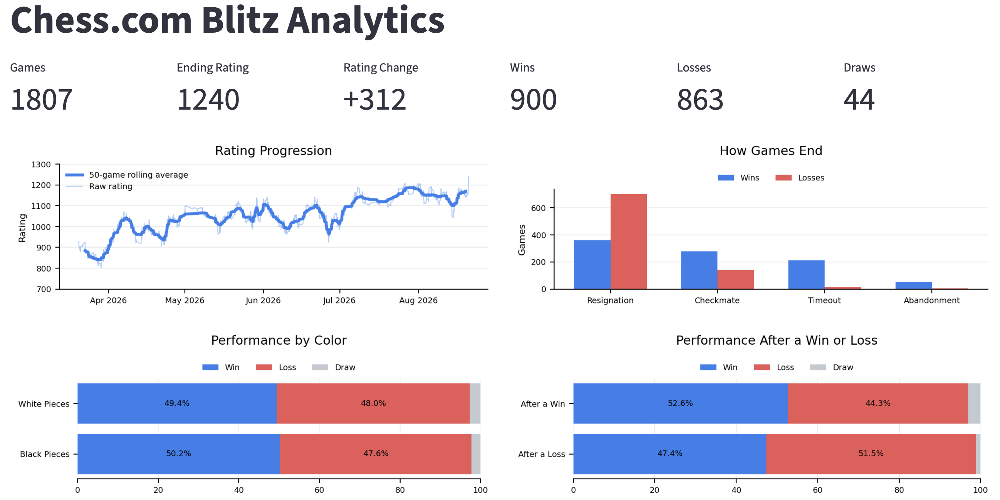
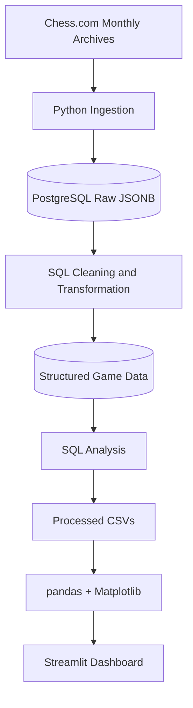

# Chess.com Blitz Analytics

An end-to-end analytics project examining 1,807 of my Chess.com blitz games using Python, PostgreSQL, SQL, pandas, Matplotlib, and Streamlit.

### [Launch the Interactive Dashboard →](https://chess-analytics-x8zynydycthfmcmgenkqyv.streamlit.app/)

## Project Overview

I collected monthly Chess.com game archives with Python and stored the raw nested JSON data in PostgreSQL using JSONB. I then used SQL to extract and transform the data into structured relational tables and perform the core analysis, using joins, CTEs, window functions, aggregations, and conditional logic.

I exported the resulting query outputs as CSV files, loaded them into pandas for light final cleanup where needed, and created visualizations with Matplotlib. Finally, I built a Streamlit dashboard to present key performance trends, opening results, and game-level statistics interactively.

## Questions Explored

- How has my blitz rating changed over time?
- How do I win and lose games?
- Does my performance differ when playing with the white pieces versus the black pieces?
- Which openings are associated with my strongest and weakest results?
- Which opposing openings give me the most difficulty?
- Does my performance differ after a win compared with after a loss?

## Data Pipeline

## Data Ingestion and Database Setup

Chess.com monthly archive data was retrieved with Python and loaded into a PostgreSQL `raw_archives` table as JSONB. Each monthly archive was stored before being transformed so that the original source data remained available.

SQL was then used to extract game-level fields from the nested JSON, including timestamps, ratings, results, openings, and player color. These transformed records were stored in structured tables.

## Key Findings

- **Rating improved substantially across the analysis period**, despite several short periods of decline.
- **Timeouts are much more common in wins than losses**, suggesting that time management may be a relative strength in my blitz games.
- **Performance by opening varies more noticeably than performance by color**.
- **Previous-game result is associated with subsequent performance:** win rate rises to 52.6% after a win and falls to 47.4% after a loss.

## Tools and Technologies

- **Python** — retrieved Chess.com archive data and loaded it into PostgreSQL
- **PostgreSQL** — stored raw JSONB data and structured game-level data
- **SQL** — transformed JSONB data, cleaned records, joined tables, and created analytical queries
- **pandas** — loaded processed datasets and prepared data for visualization
- **Matplotlib** — created the project visualizations
- **Streamlit** — built the final interactive dashboard
- **Jupyter Notebook** — documented exploratory analysis and findings
- **Git / GitHub** — version control and project documentation

## Data Scope and Limitations

- Earlier March games were excluded because they immediately followed an extended break from chess and primarily reflected rating readjustment after inactivity.
- The analysis represents the performance of a single player, so the findings should not be generalized to Chess.com players overall.
- Opening results may be influenced by factors such as opponent strength, position familiarity, and differing sample sizes across openings.
- The relationship between the previous game's result and the next game's outcome is observational and should not be interpreted as causal.